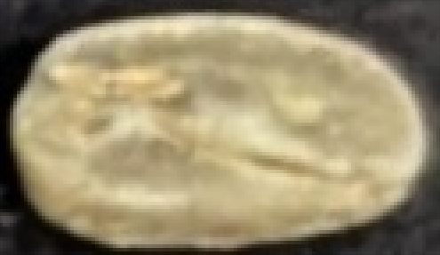
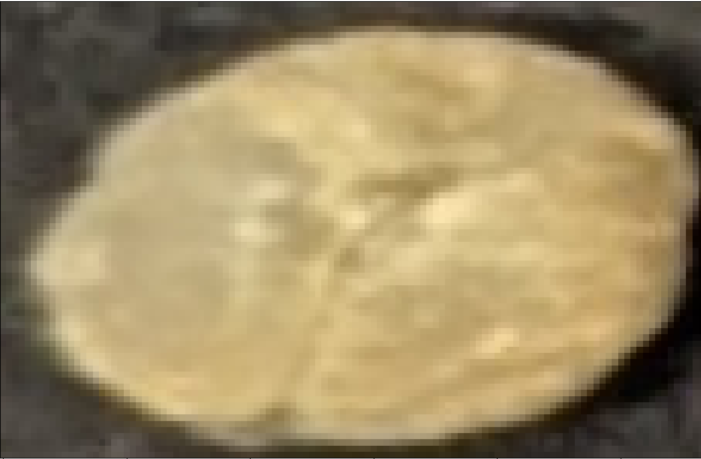
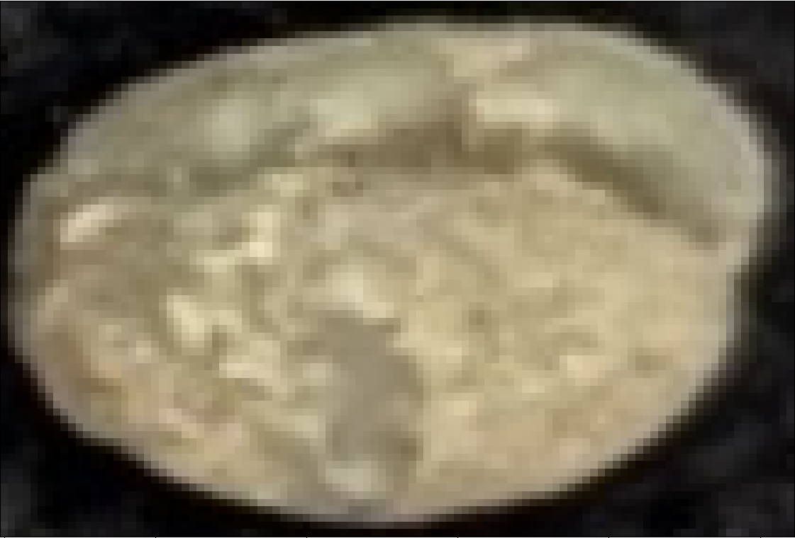
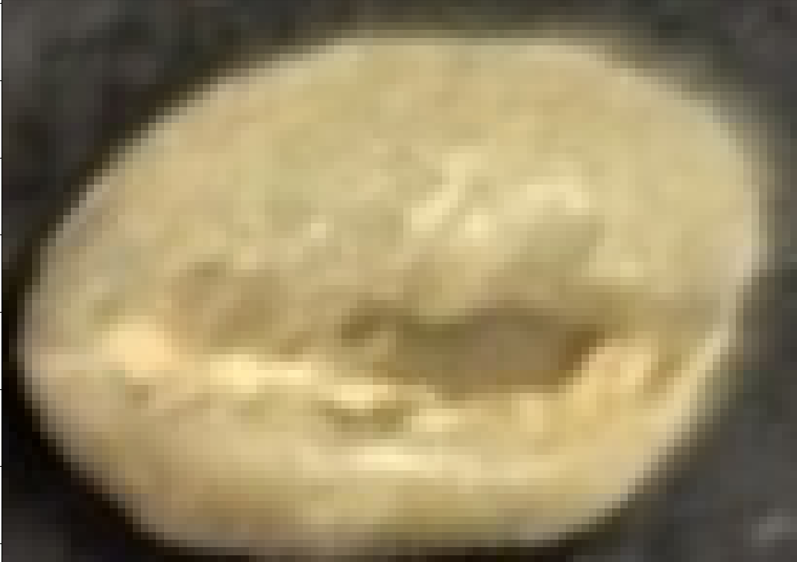
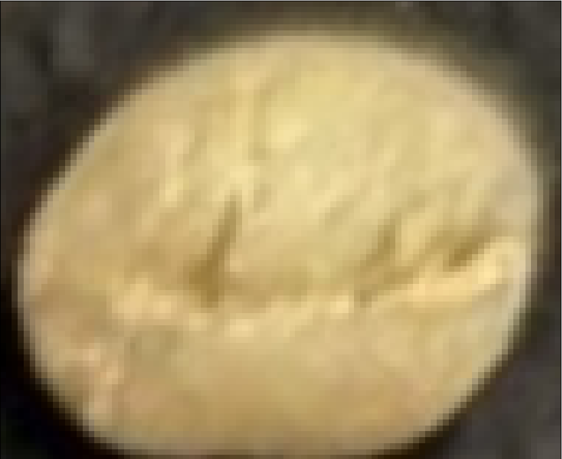

# 資料標註原則
資料集一共分成7類：
```yaml
  '1': OK 
  '2': IMMATURE         #銀皮(要覆蓋到整個都是才算)
  '3': LOOKS_WEIRD      #表面瑕疵(看起來有問題就算)
  '4': INSECT_DAMAGE    #蟲害(表面有洞的)
  '5': BROKEN           #形狀不對
  '6': OVERLAPPED       #重疊(畫面中有多顆咖啡豆)
  '7': OTHER            #其他(不是咖啡豆的東西)
  '8': LOTTERY          #長得醜醜的，但還是可以用的咖啡豆
```
左邊1~8表示在標註程式中按下對應按鍵會標註的類型
序號越大的表示優先序越高，如果遇到有問題的豆子優先以該級別標註
比如同時破損與蟲害，那麼就優先標註破損

# OK
OK類別定義很廣泛
最標準的OK應該像這樣，應該有點偏向翡翠的顏色，但可能因為光照環境不同而不同
  
以下是範例
  
  
  

# IMMATURE
針對銀皮，如果畫面占比不超過10%的銀皮，則一樣當作OK
  

底下這種就直接當作銀皮類別
  
  
  
  
  

如果有混合其他類別的，也要標註銀皮


# LOOKS_WEIRD(表面瑕疵)
這個分類主要處理**會影響咖啡風味的**豆子
只要顏色明顯往褐色偏，就算是一種瑕疵(輕微腐敗)
  

如果有明顯色塊不同，也算是一種瑕疵
包括忽然出現咖啡色塊(可能是凋零、真菌)、黑色塊(發霉)都算這種
  
  
  
  
  


長得不可名狀的也是這類(有時候會合併銀皮特徵與BROKEN特徵)
  
  


# BROKEN
只要形狀錯誤就算
無論是邊緣錯誤，或是表面形狀不正確都算，貝殼豆也算這類

邊緣錯誤例子：
  
  
  
  
  
  

表面形狀不正確例子：
  
  
  

都不正確的例子：
  
  
  
  

# INSECT_DAMAGE
只要圖片上有一個明顯黑點就算
  
  
如果有好幾個點當然也算這類
  

如果是出現在邊緣，也算蟲害
豆子的蟲害點出現在豆子的邊緣處非常常見，所以這邊可以判斷嚴格一點，只要看起來有就可以算
  
  
  

# OVERLAPPED
複數顆豆子同時出現，我猜不用我多解釋?

# OTHER
明顯不是咖啡豆的東西，比如碎塊、殘渣、麻線殘渣、或是因為影像處理物檢測沒濾掉的東西
  
  
  

# LOTTERY
長得醜醜的，但沒有明顯瑕疵，只是長得醜而已
比如：表面刮傷、形狀長得不標準(但還不算破掉)
如果看起來是豆子內部發黑，算是發霉豆，就不算在這類
但如果是表面有一點淺淺的黑色，那其實就算刮傷，就算這類


  
  
  
  
